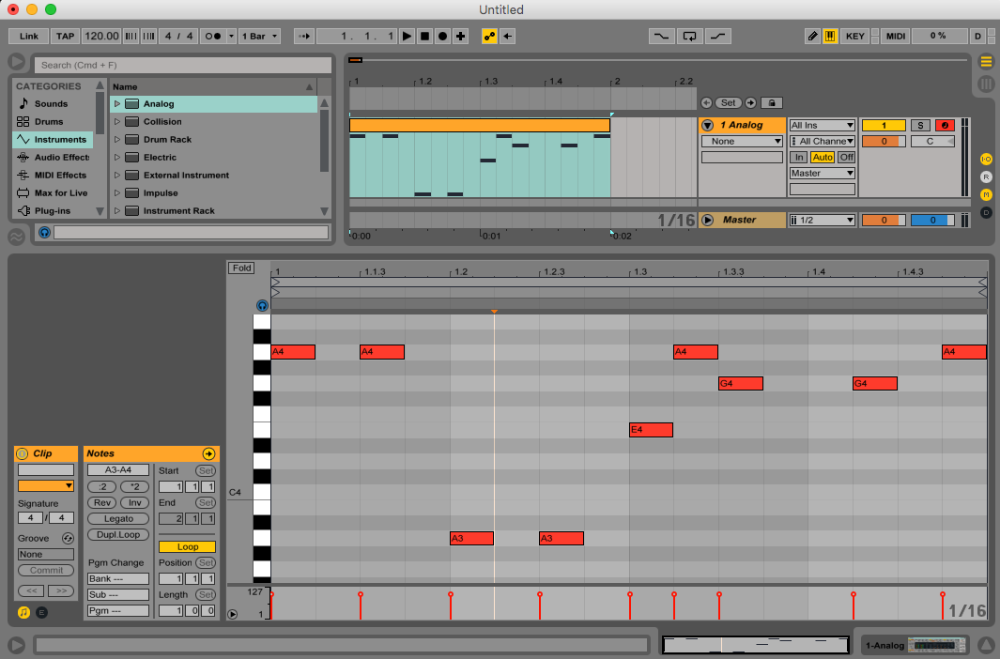

# project-visualization

## v0 - Initial Visualization

1.) Preparation  
Initial Test Audio Specs:
* 2 seconds
* 120bpm
* 44100Hz sample rate
* 24 bit depth
* no dither  
* 
* [link to .wav audio clip used](assets/visualizer_120bpm2s.wav)

2.) Consumption  
3.) Processing  
4.) Initial Visualization  
